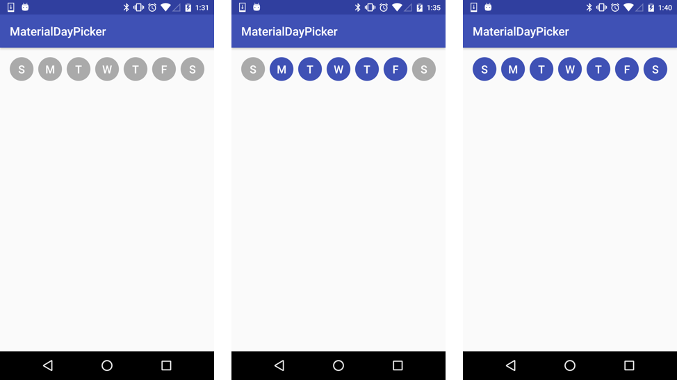

# MaterialDayPicker

Inspired by the day picker in the builtin Android clock app:



## Download

```groovy
dependencies {
    compile 'ca.antonious:materialdaypicker:0.3.0'
}
```

## Using MaterialDayPicker in your App

You can just drop the view into your existing xml:

```xml
<ca.antonious.materialdaypicker.MaterialDayPicker
    android:id="@+id/day_picker"
    android:layout_width="match_parent"
    android:layout_height="wrap_content"/>
```

You can overide these three colors to change how the date picker looks:

```xml
<color name="dayPressed">#303F9F</color>
<color name="daySelected">#3F51B5</color>
<color name="dayDeselected">@android:color/darker_gray</color>
```

You can get the currently selected days by using:

```java
List<MaterialDayPicker.Weekday> daysSelected = materialDayPicker.getSelectedDays();
// returns [MaterialDayPicker.Weekday.TUESDAY, MaterialDayPicker.Weekday.FRIDAY]
```

If you want to listen to whenever the day selection is changed you can use:

```java
materialDayPicker.setDaySelectionChangedListener(new MaterialDayPicker.DaySelectionChangedListener() {
    @Override
    public void onDaySelectionChanged(List<MaterialDayPicker.Weekday> selectedDays) {
        // handle selection change
    }
});
```

## License

```
MIT License

Copyright (c) 2017 George Antonious

Permission is hereby granted, free of charge, to any person obtaining a copy
of this software and associated documentation files (the "Software"), to deal
in the Software without restriction, including without limitation the rights
to use, copy, modify, merge, publish, distribute, sublicense, and/or sell
copies of the Software, and to permit persons to whom the Software is
furnished to do so, subject to the following conditions:

The above copyright notice and this permission notice shall be included in all
copies or substantial portions of the Software.

THE SOFTWARE IS PROVIDED "AS IS", WITHOUT WARRANTY OF ANY KIND, EXPRESS OR
IMPLIED, INCLUDING BUT NOT LIMITED TO THE WARRANTIES OF MERCHANTABILITY,
FITNESS FOR A PARTICULAR PURPOSE AND NONINFRINGEMENT. IN NO EVENT SHALL THE
AUTHORS OR COPYRIGHT HOLDERS BE LIABLE FOR ANY CLAIM, DAMAGES OR OTHER
LIABILITY, WHETHER IN AN ACTION OF CONTRACT, TORT OR OTHERWISE, ARISING FROM,
OUT OF OR IN CONNECTION WITH THE SOFTWARE OR THE USE OR OTHER DEALINGS IN THE
SOFTWARE.
```
