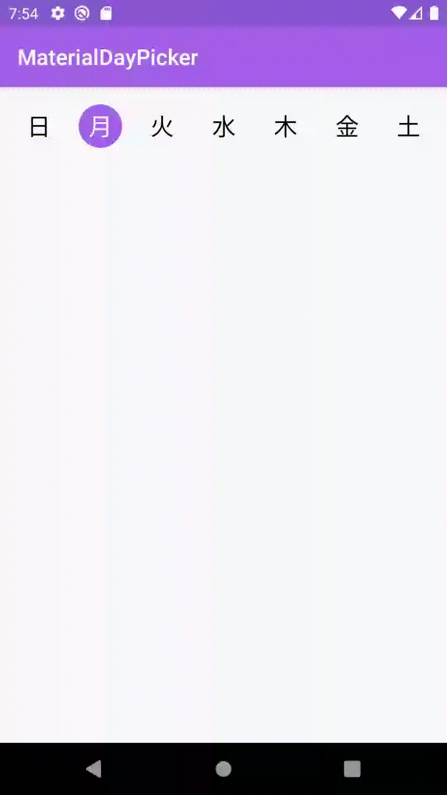
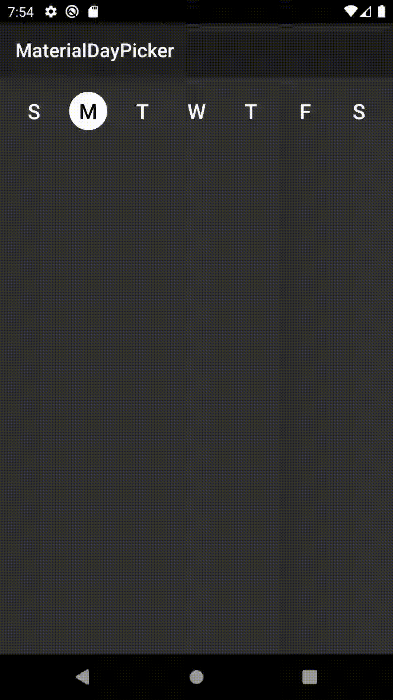

# MaterialDayPicker

[](https://circleci.com/gh/gantonious/MaterialDayPicker) [](https://bintray.com/gantonious/maven/materialdaypicker/_latestVersion)


Inspired by the day picker in the builtin Android clock app. 

**Note:** I'm not actively working on new features for this library. I'm only addressing critical bugs. With that being said contributions for new features are more than welcome and I am available to review pull requests. See [contributing.md](https://github.com/gantonious/MaterialDayPicker/blob/dev/CONTRIBUTING.md) if you're interested in contributing.

|Normal Usage|Localized Usage|Dark Mode Usage|
|---|---|---|
||||

## Features
- 🎨 Customizable theming
- ✅ Easy to use API/hooks
- 🌎 Fully localized
- 👻 Supports dark mode

## What's New: Version 0.7.3 - Better Configuration + Bug fixes

- Upgraded MaterialDayPicker to target API 30 and upgraded its AndroidX dependencies

### Changes from 0.7.2

**Bug fixes**
- Fixes a bug when using android gradle plugin `3.6.1` that would cause building to fail due to not being able to find the `selectionMode` attribute.

### Changes from 0.7.1

**Bug fixes**
- Fixes an issue where calling `setSelectedDays` would cause selected days to flash off and on.

### Changes from 0.7.0

**Configuration Improvements**
- You can now enable/disable days from being selected using enableDay/disableDay methods. See more below.
- You can now set the selection mode via xml by using the `app:selectionMode` attribute.

Download the latest version by adding the following to your project's `build.gradle` file:

```groovy
dependencies {
    implementation 'ca.antonious:materialdaypicker:0.7.3'
}
```

## Using MaterialDayPicker in your App

You can just drop the view into your existing xml:

```xml
<ca.antonious.materialdaypicker.MaterialDayPicker
    android:id="@+id/day_picker"
    android:layout_width="match_parent"
    android:layout_height="wrap_content"/>
```

You can get the currently selected days by using:

```kotlin
val selectedDays = materialDayPicker.selectedDays
// returns [MaterialDayPicker.Weekday.TUESDAY, MaterialDayPicker.Weekday.FRIDAY]
```

You can set the selected days by doing:

```kotlin
val daysToSelect = listOf(MaterialDayPicker.Weekday.TUESDAY, MaterialDayPicker.Weekday.FRIDAY)
materialDayPicker.setSelectedDays(daysToSelect)
```

If you want to only allow one day to be selected at a time you can do:

```kotlin
materialDayPicker.selectionMode = SingleSelectionMode.create()
```

This can also be set via xml using the `selectionMode` attribute:

```xml
<ca.antonious.materialdaypicker.MaterialDayPicker
    ...
    app:selectionMode="ca.antonious.materialdaypicker.SingleSelectionMode"/>
```

You can enable/disable days using the following methods. Note if you disable a day when it's selected it cannot be deselected:

```kotlin
materialDayPicker.enableDay(MaterialDayPicker.Weekday.Monday)
materialDayPicker.disableDay(MaterialDayPicker.Weekday.Monday)
materialDayPicker.setDayEnable(MaterialDayPicker.Weekday.Monday, isEnabled = false)
```

If you want to listen to whenever the day selection is changed you can use:

```kotlin
materialDayPicker.setDaySelectionChangedListener { selectedDays ->
    // handle selection change
}
```

If you need to know when a specific day is selected/deselected you can use:


```kotlin
materialDayPicker.setDayPressedListener { weekday, isSelected ->
    // handle weekday selection
}
```

## Customizing MaterialDayPicker for your App

You can override these colors to change how MaterialDayPicker looks. You can also update these values in your night color resources directory to update how MaterialDayPicker looks in dark mode:

```xml
<color name="dayPressed">@color/colorPrimaryDark</color>
<color name="daySelected">@color/colorPrimary</color>
<color name="daySelectedTextColor">@android:color/white</color>
<color name="dayDeselected">#FAFAFA</color>
<color name="dayDeselectedTextColor">@android:color/black</color>

<!-- Customizing colors for disabled days-->
<color name="daySelectedAndDisabled">#43444F</color>
<color name="daySelectedAndDisabledTextColor">@color/daySelectedTextColor</color>
<color name="dayDeselectedAndDisabled">@color/dayDeselected</color>
<color name="dayDeselectedAndDisabledTextColor">@android:color/darker_gray</color>
```

If you don't want to use the device's current locale you can override it by doing:

```kotlin
materialDayPicker.locale = Locale.ENGLISH // or any other locale
```

## License

```
MIT License

Copyright (c) 2017 George Antonious

Permission is hereby granted, free of charge, to any person obtaining a copy
of this software and associated documentation files (the "Software"), to deal
in the Software without restriction, including without limitation the rights
to use, copy, modify, merge, publish, distribute, sublicense, and/or sell
copies of the Software, and to permit persons to whom the Software is
furnished to do so, subject to the following conditions:

The above copyright notice and this permission notice shall be included in all
copies or substantial portions of the Software.

THE SOFTWARE IS PROVIDED "AS IS", WITHOUT WARRANTY OF ANY KIND, EXPRESS OR
IMPLIED, INCLUDING BUT NOT LIMITED TO THE WARRANTIES OF MERCHANTABILITY,
FITNESS FOR A PARTICULAR PURPOSE AND NONINFRINGEMENT. IN NO EVENT SHALL THE
AUTHORS OR COPYRIGHT HOLDERS BE LIABLE FOR ANY CLAIM, DAMAGES OR OTHER
LIABILITY, WHETHER IN AN ACTION OF CONTRACT, TORT OR OTHERWISE, ARISING FROM,
OUT OF OR IN CONNECTION WITH THE SOFTWARE OR THE USE OR OTHER DEALINGS IN THE
SOFTWARE.
```
